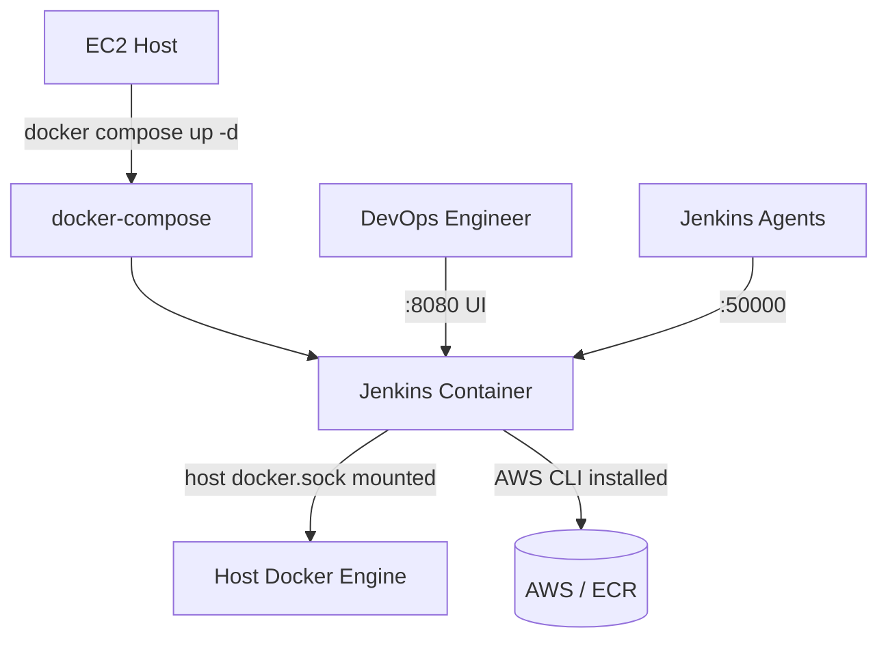

# Platform Repo — Jenkins on EC2

Bootstraps the Jenkins controller used to run the CI/CD pipeline for the
[calculator-app-v2](https://github.com/mikelj14/calculator-app-v2.zip)
application repo. This repo is intentionally small — its only job is to
get a working, reboot-resilient Jenkins up on a fresh EC2 host using
Docker and docker-compose.

## Architecture



Jenkins runs as a single container, but its pipeline stages spin up their
*own* short-lived Docker containers for build/test/deploy work — that's
why this Jenkins container needs access to the host's Docker engine rather
than just being able to run Docker commands against itself.

## What's here

| File | Purpose |
|---|---|
| `Dockerfile` | Custom Jenkins image: base `jenkins/jenkins:lts-jdk17` + Docker CLI + AWS CLI v2 + a starter plugin set |
| `docker-compose.yml` | Runs the Jenkins container with the right volumes, ports, and restart policy |

### Dockerfile

Built on top of the official Jenkins LTS image, with:
- **Docker CLI** installed (not the daemon — see below) so pipeline stages
  can run `docker build`/`docker run` against the host's engine.
- **AWS CLI v2** installed so pipeline stages can authenticate to ECR.
- The `jenkins` user added to the `root` group, needed to access the
  mounted Docker socket.
- A starter plugin set installed via `jenkins-plugin-cli`:
  `docker-plugin`, `docker-workflow`, `github`.

### docker-compose.yml

- `restart: always` — Jenkins comes back up automatically after an EC2
  reboot, satisfying the "runs reliably after a reboot" requirement.
- `jenkins_home` named volume — configuration, credentials, job history,
  and any plugins installed later all persist across container
  rebuilds/restarts.
- `/var/run/docker.sock` mounted from the host — this is what lets
  Jenkins pipeline stages build and run Docker containers on the host
  engine (Docker-outside-of-Docker) instead of needing Docker installed
  *inside* Jenkins' own container.
- Ports `8080` (Jenkins UI) and `50000` (inbound agent connections).

## Setup

```bash
git clone https://github.com/mikelj14/Platform-repo.git
cd Platform-repo
docker compose up -d --build

# get the initial admin password
docker exec jenkins cat /var/jenkins_home/secrets/initialAdminPassword
```

Then open `http://<ec2-public-ip>:8080`, unlock Jenkins with that
password, and complete setup (create an admin user, etc.).

## ⚠️ Security trade-off worth knowing

Mounting the host's Docker socket into a container is a common and
practical way to let Jenkins build/run Docker images without a full
Docker-in-Docker setup — but it's not free. Anything with access to
`docker.sock` can effectively run containers as root on the host, which
is functionally root-equivalent access to the EC2 instance. Combined with
adding the `jenkins` user to the `root` group, this Jenkins container has
broad control over its host. That's an accepted, common trade-off for a
training/lab environment; on a real production Jenkins host you'd want to
weigh a Docker-in-Docker agent, a dedicated build node, or rootless Docker
instead.

## Known limitation: plugin list isn't fully reproducible yet

The pipeline in `calculator-app-v2` runs as a **Multibranch Pipeline**
(it uses `env.CHANGE_ID` and per-branch `when` conditions), and also
relies on `withCredentials`, `junit`, and Git checkout steps. Those need
plugins beyond the three currently pinned in the Dockerfile —
at minimum `github-branch-source`, `workflow-aggregator` (Pipeline), `git`,
`credentials-binding`, `ssh-credentials`, and `junit`.

Right now those almost certainly got added by hand through the Jenkins UI
after first boot, which works (they persist in the `jenkins_home` volume)
but means a genuinely fresh `docker compose up --build` on a brand-new
volume wouldn't have everything the pipeline needs out of the box. Next
step is pinning the full plugin list in the Dockerfile so the whole
platform is reproducible from this repo alone.

## Technologies

| Technology | Purpose |
|---|---|
| Docker / docker-compose | Runs and persists the Jenkins controller |
| Jenkins | CI/CD orchestration |
| AWS CLI | ECR authentication from within pipeline stages |
| GitHub | Hosts this repo and the application repo it serves |

## Related

- Application + pipeline: [calculator-app-v2](https://github.com/mikelj14/calculator-app-v2.zip)
